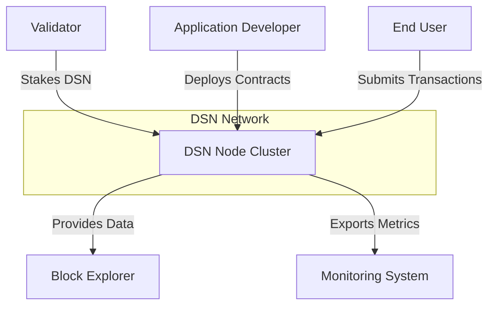
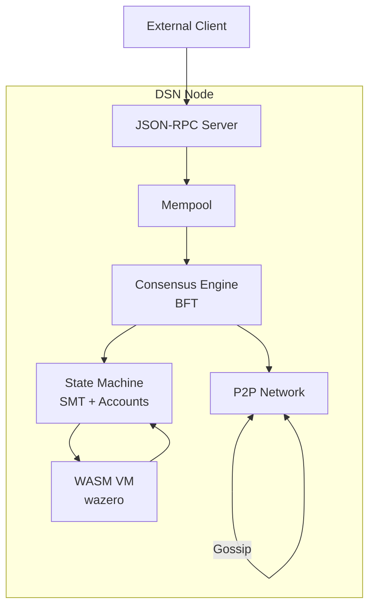
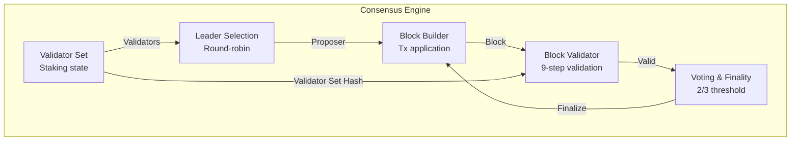
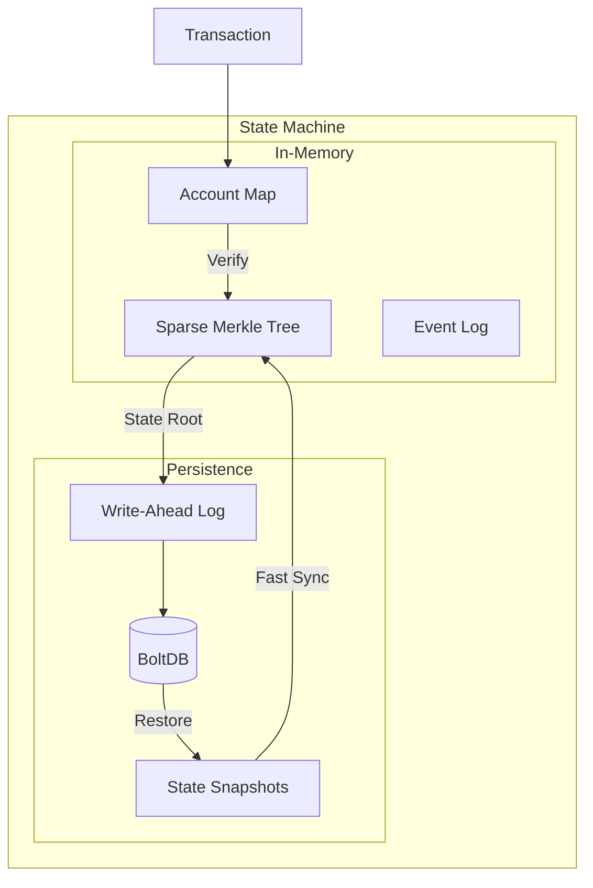
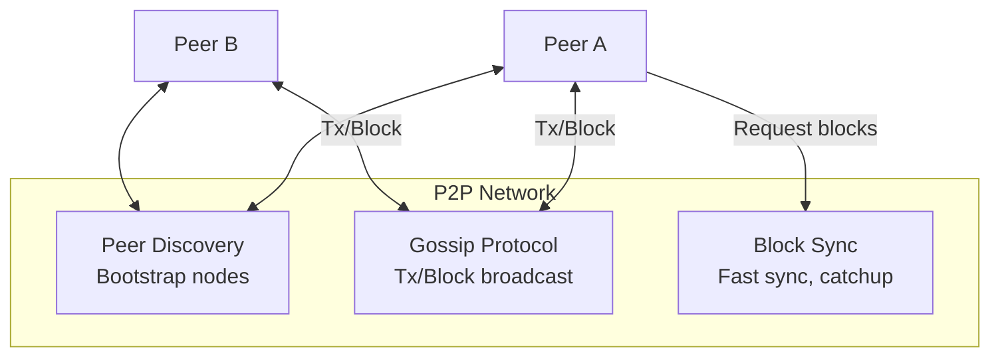
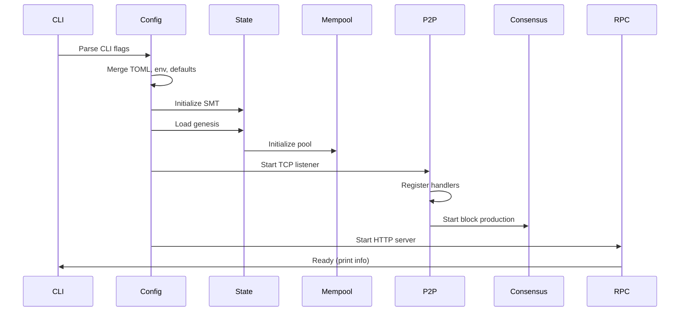

# DSN Architecture

This document describes the system architecture of the Deterministic Settlement Network (DSN), a financial-grade blockchain designed for settlement finality.

## C4 Model Overview

DSN follows the C4 (Context, Container, Component, Code) model for architecture documentation:

- **Level 1 (Context)** — External actors and system boundaries
- **Level 2 (Container)** — Major architectural components
- **Level 3 (Component)** — Internal component details
- **Level 4 (Code)** — Implementation-level detail (see source files)

## Level 1: System Context



**External Actors:**
- **Validators** — Participate in BFT consensus, produce blocks, earn rewards
- **Application Developers** — Deploy WASM smart contracts, build on DSN
- **End Users** — Send transactions, query state, hold DSN tokens
- **Block Explorers** — Index blocks and transactions for visibility
- **Monitoring Systems** — Prometheus/Grafana for observability

## Level 2: Container Diagram



**Container Responsibilities:**

| Container | Responsibility | Key Files |
|-----------|----------------|-----------|
| **JSON-RPC Server** | HTTP API for clients | `rpc/server.go`, `rpc/methods.go` |
| **Mempool** | Transaction ordering, validation | `mempool/pool.go` |
| **State Machine** | Account storage, SMT commitment | `state/memory.go`, `state/smt.go` |
| **WASM VM** | Smart contract execution | `vm/vm.go`, `vm/runtime.go`, `vm/host.go` |
| **Consensus Engine** | Block production, finality | `consensus/system.go`, `consensus/block_builder.go` |
| **P2P Network** | Peer discovery, block sync | `network/p2p.go`, `network/gossip.go` |

## Level 3: Component Diagrams

### Consensus Component



**Consensus Flow:**
1. **Leader Selection** — Round-robin based on `height % validator_count`
2. **Block Building** — Proposer selects tx from mempool, applies state transitions
3. **Block Validation** — 9-step validation (height, proposer, state root, etc.)
4. **Voting** — Validators vote on block; 2/3 threshold = finality
5. **State Commit** — Finalized block commits to state (SMT update)

### State Component



**State Responsibilities:**
- **SMT** — Cryptographic commitment (32-byte root for every state)
- **Accounts** — Balance, nonce, code hash per address
- **Events** — Emit events from contract execution
- **Persistence** — BoltDB with WAL for crash recovery
- **Snapshots** — Periodic state snapshots for fast sync

### Network Component



**Network Responsibilities:**
- **Discovery** — Bootstrap from seed nodes, maintain peer list
- **Gossip** — Broadcast transactions and blocks to all peers
- **Sync** — Fast block synchronization for new/recovering nodes
- **Wire Protocol** — `[4-byte length][payload]` TCP messages

## Package Overview

### `types/` — Core Data Types

Pure data structures and serialization. The foundation everything else builds on.

- `types/address.go` — Base58Check-encoded 20-byte addresses from Ed25519 public keys
- `types/hash.go` — 32-byte SHA256 hashes (transaction IDs, state roots, block hashes)
- `types/amount.go` — 128-bit unsigned integer for DSN amounts (math/big.Int)
- `types/transaction.go` — Intent-based transactions with unique IntentID for idempotency
- `types/block.go` — Block structure with header, transactions, fee summary, proposer signature

### `state/` — State Engine

Account storage, SMT commitment, transaction execution, and persistence.

- `state/smt.go` — 256-bit Sparse Merkle Tree for cryptographic state commitment
- `state/memory.go` — Thread-safe in-memory state (default, used in tests)
- `state/persistent.go` — BoltDB-backed persistent state (auto-selected when DataDir is set)
- `state/transitions.go` — Core state mutations (Transfer, Mint, Burn)
- `state/applier.go` — Transaction validation and execution sequence

### `mempool/` — Transaction Memory Pool

Receives, validates, orders, and holds pending transactions before block inclusion.

- `mempool/pool.go` — Mempool with capacity limits, TTL expiry, fee-based ordering
- Validation: signature, nonce, balance, deduplication (IntentID)
- Ordering: highest fee first, then oldest timestamp, then lexicographic IntentID

### `wallet/` — Key Management

Ed25519 key pair generation, storage, and transaction signing.

- `wallet/wallet.go` — GenerateKey, SaveKey, LoadKey, Sign, Verify
- `wallet/validator.go` — Validator key management and stake operations

### `network/` — P2P Networking

TCP-based peer-to-peer networking. Custom protocol (no libp2p to avoid Windows version conflicts).

- `network/p2p.go` — P2PNode with Connect, GossipTransaction, Broadcast, peer handlers
- Wire format: `[4-byte length][payload]`
- Message types: `0x01` = block, other = transaction
- `network/blocksync.go` — Block synchronization and fast catchup

### `consensus/` — Block Production and Validation

Deterministic Intent Consensus (DIC) — round-robin leader selection over a static validator set.

- `consensus/leader.go` — ProposerAtHeight: `validators[height % len(validators)]`
- `consensus/validator_set.go` — ValidatorRoot from sorted validator addresses
- `consensus/block_builder.go` — BuildBlock with tx application, fee distribution, state commit
- `consensus/block_validator.go` — 9-step block validation (height, proposer, state root, etc.)
- `consensus/gossip.go` — Block encoding/decoding for P2P broadcast
- `consensus/voting.go` — Vote collection and finality determination

### `staking/` — Validator Staking

Validator registration, epoch management, rewards, and slashing.

- `staking/staking.go` — Staking operations (stake, unstake, delegate)
- `staking/validator.go` — Validator state and metadata
- `staking/registry.go` — Validator registry management
- `staking/epoch.go` — Epoch transitions and boundaries
- `staking/rewards.go` — Inflation distribution (10% treasury, 90% validators)
- `staking/slashing.go` — Evidence-based slashing for Byzantine behavior

### `vm/` — WASM Smart Contract Runtime

Deterministic smart contract execution via wazero.

- `vm/vm.go` — VM interface and contract invocation
- `vm/runtime.go` — WASM module instantiation and execution
- `vm/host.go` — Host functions available to contracts (balance, storage, events)
- `vm/gas.go` — Gas metering and limits

### `node/` — Node Orchestrator

Ties together state, mempool, P2P networking, and consensus into a running DSN node.

- `node/node.go` — Node struct with StartConsensus, StopConsensus, SubmitTx, Close
- `node/startup.go` — 14-step startup sequence with phase tracking

### `rpc/` — JSON-RPC Server

HTTP JSON-RPC 2.0 server for external interaction.

- `rpc/server.go` — Server initialization and middleware
- `rpc/methods.go` — dsn_getBalance, dsn_getAccount, dsn_sendTransaction, dsn_getPendingTxs

### `genesis/` — Genesis Creation

Genesis block initialization and validator setup.

- `genesis/genesis.go` — Genesis block creation
- `genesis/validation.go` — Genesis file validation

### `config/` — Configuration Management

- `config/config.go` — TOML parsing, env var loading, CLI flag merging
- Configuration precedence: `defaults < TOML < environment (DSN_*) < CLI flags`

## Startup Sequence (14 Steps)



1. **Parse CLI flags** — Load `-config`, `-genesis`, `-wallet` flags
2. **Load config** — Merge defaults, TOML, env vars, CLI flags
3. **Initialize hasher** — SHA256Hasher for all hashing operations
4. **Create/open BoltDB** — If DataDir is set, open `dsn.db`
5. **Initialize SMT** — Create sparse Merkle tree for state commitment
6. **Load genesis** — Read genesis.json, validate, apply initial state
7. **Initialize state** — InMemoryState or PersistentState based on DataDir
8. **Initialize mempool** — Create with configured max size and TTL
9. **Create P2P node** — If P2PPort > 0, start TCP listener
10. **Setup P2P handlers** — Register tx/block callbacks → mempool.Submit
11. **Start consensus** — If validators configured, begin block production loop
12. **Start RPC server** — Begin JSON-RPC HTTP listener
13. **Mark ready** — Print startup info (state root, RPC address, P2P ID)
14. **Wait for shutdown** — Handle SIGINT/SIGTERM, persist state, close resources

## Design Decisions

| Decision | Choice | Rationale |
|----------|--------|-----------|
| **Keys** | Ed25519 | Modern, fast, well-audited elliptic curve; avoids secp256k1 complexity |
| **Storage** | BoltDB | Pure Go, no CGO, ACID-compliant, simple embedded KV store |
| **State** | SMT | Cryptographic state commitment; every state change produces a new 32-byte root |
| **Serialization** | Canonical JSON | Consistent serialization for determinism |
| **Governance** | None (off-chain) | Simple protocol; coordinated upgrades via social consensus |
| **Layering** | Single layer | No L2; L2 solutions handled externally |
| **Accounts** | Native only | No account abstraction; Ed25519 keys only |

## File Layout

```
dsn/
├── cmd/dsn/             # CLI entry point
├── cmd/dsn-tui/         # Terminal UI
├── types/               # Address, Hash, Amount, Transaction, Block
├── state/               # SMT, accounts, persistence
├── mempool/             # Transaction pool
├── wallet/              # Ed25519 key management
├── network/             # P2P networking
├── consensus/           # Block production/validation
├── staking/             # Validator staking, rewards, slashing
├── node/                # Node orchestrator
├── rpc/                 # JSON-RPC server
├── vm/                  # WASM smart contract runtime
├── genesis/             # Genesis creation
├── config/              # Configuration
├── telemetry/           # Logging, metrics
├── indexer/             # Block indexer
├── explorer/            # Block explorer
├── sdk/                 # Go SDK
├── docs/                # Protocol specification
├── benchmarks/          # Performance tests
└── integration/         # Integration tests
```

## See Also

- [Protocol Spec](docs/dsn_protocol_spec_v_1.md) — Complete protocol specification
- [Whitepaper](docs/deterministic_settlement_network_whitepaper_v_1.md) — Design goals
- [Quick Start](QUICKSTART.md) — Running a local network
- [Contract Guide](CONTRACT_QUICKSTART.md) — Deploying WASM contracts