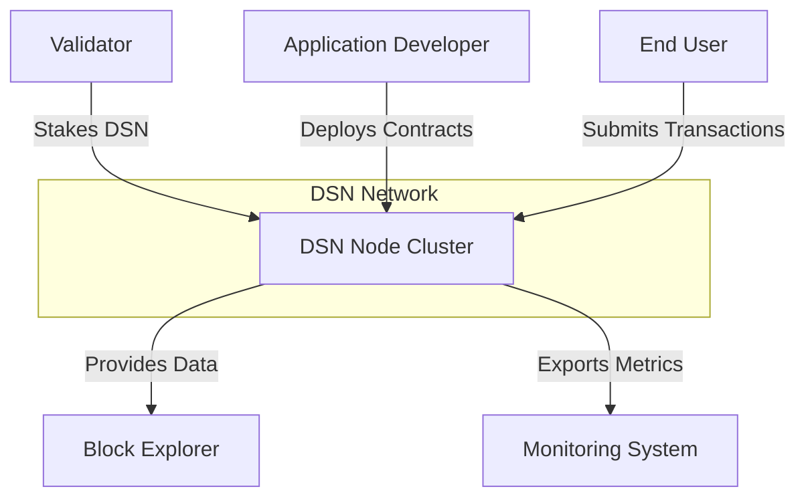
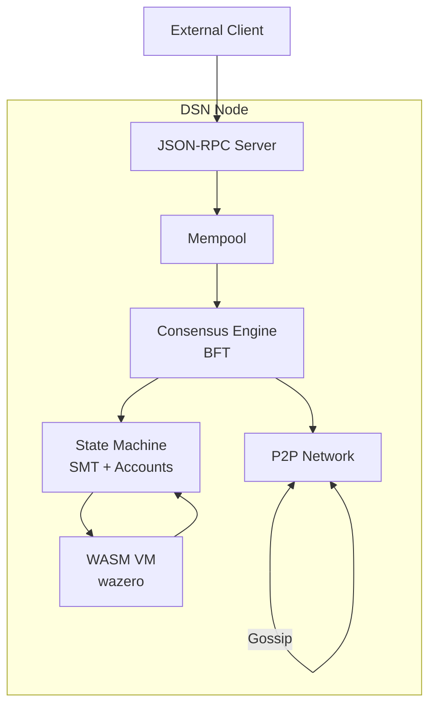
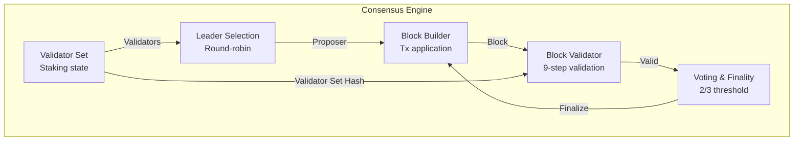
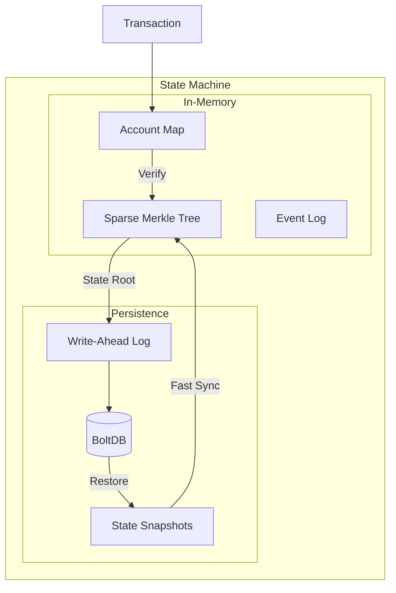
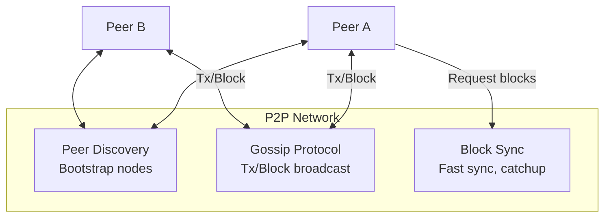
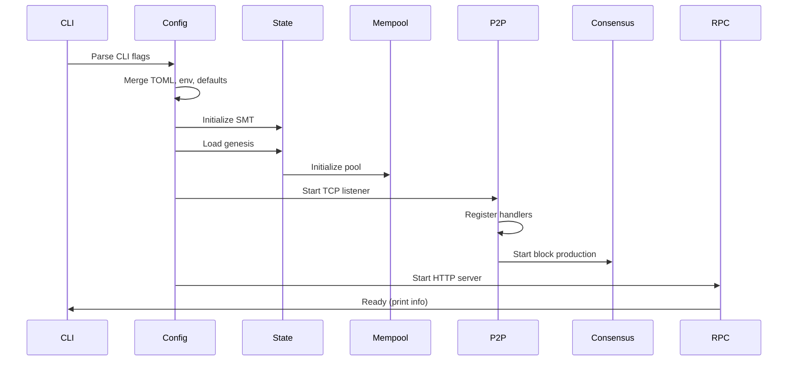

# DSN Architecture

This document describes the system architecture of the Deterministic Settlement Network (DSN), a financial-grade blockchain designed for settlement finality.

## Table of Contents

- [C4 Model Overview](#c4-model-overview)
- [Level 1: System Context](#level-1-system-context)
- [Level 2: Container Diagram](#level-2-container-diagram)
- [Level 3: Component Diagrams](#level-3-component-diagrams)
  - [Consensus Component](#consensus-component)
  - [State Component](#state-component)
  - [Network Component](#network-component)
- [Package Overview](#package-overview)
- [Startup Sequence (14 Steps)](#startup-sequence-14-steps)
- [Design Decisions](#design-decisions)
- [File Layout](#file-layout)
- [Consensus Protocol](#consensus-protocol)
- [Networking & P2P](#networking--p2p)
- [WASM Virtual Machine](#wasm-virtual-machine)
- [State Persistence](#state-persistence)
- [Security Model](#security-model)

---

## C4 Model Overview

DSN follows the C4 (Context, Container, Component, Code) model for architecture documentation:

- **Level 1 (Context)** — External actors and system boundaries
- **Level 2 (Container)** — Major architectural components
- **Level 3 (Component)** — Internal component details
- **Level 4 (Code)** — Implementation-level detail (see source files)

## Level 1: System Context



**External Actors:**
- **Validators** — Participate in BFT consensus, produce blocks, earn rewards
- **Application Developers** — Deploy WASM smart contracts, build on DSN
- **End Users** — Send transactions, query state, hold DSN tokens
- **Block Explorers** — Index blocks and transactions for visibility
- **Monitoring Systems** — Prometheus/Grafana for observability

## Level 2: Container Diagram



**Container Responsibilities:**

| Container | Responsibility | Key Files |
|-----------|----------------|-----------|
| **JSON-RPC Server** | HTTP API for clients | `rpc/server.go`, `rpc/methods.go` |
| **Mempool** | Transaction ordering, validation | `mempool/pool.go` |
| **State Machine** | Account storage, SMT commitment | `state/memory.go`, `state/smt.go` |
| **WASM VM** | Smart contract execution | `vm/vm.go`, `vm/runtime.go`, `vm/host.go`, `vm/gas.go` |
| **Consensus Engine** | Block production, finality | `consensus/system.go`, `consensus/block_builder.go`, `consensus/block_validator.go`, `consensus/voting.go` |
| **P2P Network** | Peer discovery, block sync | `network/p2p.go`, `network/gossip.go` |

## Level 3: Component Diagrams

### Consensus Component



**Consensus Flow:**
1. **Leader Selection** — Round-robin based on `height % validator_count`
2. **Block Building** — Proposer selects txs from mempool, executes state transitions (BuildBlock), then distributes fees (FinalizeBlock)
3. **Block Validation** — 9-step validation (height, proposer, state root, etc.)
4. **Voting** — Validators vote on block; 2/3 threshold = finality
5. **State Commit** — Finalized block commits state (SMT update)
6. **Epoch Transition** — At epoch boundary: validator set updates, reward distribution, unjailing (ProcessEpochTransition)
7. **Evidence** — Slashing and jailing on evidence (ProcessEvidence) ⚠ always nil in devnet

> **Devnet architecture:** Local development runs a simplified devnet — no VM execution, single built-in block producer (no BFT voting), built-in faucet for testing. VM and consensus modules are compiled in but inactive in devnet mode.

### State Component



**State Responsibilities:**
- **SMT** — Cryptographic commitment (32-byte root for every state)
- **Accounts** — Balance, nonce, code hash per address
- **Events** — Emit events from contract execution
- **Persistence** — BoltDB with WAL for crash recovery
- **Snapshots** — Periodic state snapshots for fast sync

### Network Component



**Network Responsibilities:**
- **Discovery** — Bootstrap from seed nodes, maintain peer list
- **Gossip** — Broadcast transactions and blocks to all peers
- **Sync** — Fast block synchronization for new/recovering nodes
- **Wire Protocol** — `[4-byte length][payload]` TCP messages

## Package Overview

### `types/` — Core Data Types

Pure data structures and serialization. The foundation everything else builds on.

- `types/address.go` — Base58Check-encoded 20-byte addresses from Ed25519 public keys
- `types/hash.go` — 32-byte SHA256 hashes (transaction IDs, state roots, block hashes)
- `types/amount.go` — 128-bit unsigned integer for DSN amounts (math/big.Int)
- `types/transaction.go` — Intent-based transactions with unique IntentID for idempotency
- `types/block.go` — Block structure with header, transactions, fee summary, proposer signature

### `state/` — State Engine

Account storage, SMT commitment, transaction execution, and persistence.

- `state/smt.go` — 256-bit Sparse Merkle Tree for cryptographic state commitment
- `state/memory.go` — Thread-safe in-memory state (default, used in tests)
- `state/persistent.go` — BoltDB-backed persistent state (auto-selected when DataDir is set)
- `state/transitions.go` — Core state mutations (Transfer, Mint, Burn)
- `state/applier.go` — Transaction validation and execution sequence

### `mempool/` — Transaction Memory Pool

Receives, validates, orders, and holds pending transactions before block inclusion.

- `mempool/pool.go` — Mempool with capacity limits, TTL expiry, fee-based ordering
- Validation: signature, nonce, balance, deduplication (IntentID)
- Ordering: highest fee first, then oldest timestamp, then lexicographic IntentID

### `wallet/` — Key Management

Ed25519 key pair generation, storage, and transaction signing.

- `wallet/wallet.go` — GenerateKey, SaveKey, LoadKey, Sign, Verify
- `wallet/validator.go` — Validator key management and stake operations

### `network/` — P2P Networking

TCP-based peer-to-peer networking. Custom protocol (no libp2p to avoid Windows version conflicts).

- `network/p2p.go` — P2PNode with Connect, GossipTransaction, Broadcast, peer handlers
- Wire format: `[4-byte length][payload]`
- Message types: `0x01` = block, other = transaction
- `network/blocksync.go` — Block synchronization and fast catchup ⚠ not fully implemented

### `consensus/` — Block Production and Validation

Deterministic Intent Consensus (DIC) — round-robin leader selection with epoch-based validator set updates (registered → pending → active on epoch transition).

- `consensus/leader.go` — ProposerAtHeight: `validators[height % len(validators)]`
- `consensus/validator_set.go` — ValidatorRoot from sorted validator addresses
- `consensus/block_builder.go` — BuildBlock with tx application, fee distribution, state commit
- `consensus/block_validator.go` — 9-step block validation (height, proposer, state root, etc.)
- `consensus/gossip.go` — Block encoding/decoding for P2P broadcast
- `consensus/voting.go` — Vote collection and finality determination

### `staking/` — Validator Staking

Validator registration, epoch management, rewards, and slashing.

- `staking/staking.go` — Staking operations (stake, unstake)
- `staking/validator.go` — Validator state and metadata
- `staking/registry.go` — Validator registry management
- `staking/epoch.go` — Epoch transitions and boundaries
- `staking/rewards.go` — Inflation distribution (70% validators, 20% burned, 10% treasury)
- `staking/slashing.go` — Evidence-based slashing for Byzantine behavior

### `vm/` — WASM Smart Contract Runtime

Deterministic smart contract execution via wazero (WebAssembly 1.0).

**Host module:** `"env"` with 7 functions: `read_storage`, `write_storage`, `emit_event`, `block_info`, `caller`, `balance`, `transfer_token`.

**Sandbox limits:** 16 MiB memory, 1 MiB code size, 30s execution timeout. Gas metering on host functions only (no per-instruction metering).

⚠ `transfer_token` is a stub. Constructor called without arguments. Events not queryable post-execution.

- `vm/vm.go` — VM interface and contract invocation
- `vm/runtime.go` — WASM module instantiation and execution
- `vm/host.go` — Host functions register and dispatch
- `vm/gas.go` — Gas metering cost tables and limits

### `node/` — Node Orchestrator

Ties together state, mempool, P2P networking, and consensus into a running DSN node.

- `node/node.go` — Node struct with StartConsensus, StopConsensus, SubmitTx, Close
- `node/startup.go` — 14-step startup sequence with phase tracking

### `rpc/` — JSON-RPC Server

HTTP JSON-RPC 2.0 server for external interaction.

- `rpc/server.go` — Server initialization and middleware (CORS, rate limit, body size, request ID, metrics)
- `rpc/methods.go` — 17 JSON-RPC 2.0 methods (11 live, 4 stub, 2 legacy). ⚠ Stubs: getEvents, getValidators, getStateRoot, getPendingTxs

### `genesis/` — Genesis Creation

Genesis block initialization and validator setup.

- `genesis/genesis.go` — Genesis block creation
- `genesis/validation.go` — Genesis file validation

### `config/` — Configuration Management

- `config/config.go` — TOML parsing, env var loading, CLI flag merging
- Configuration precedence: `defaults < TOML < environment (DSN_*) < CLI flags`

## Startup Sequence (14 Steps)



1. **Parse CLI flags** — Load `-config`, `-genesis`, `-wallet` flags
2. **Load config** — Merge defaults, TOML, env vars, CLI flags
3. **Initialize hasher** — SHA256Hasher for all hashing operations
4. **Create/open BoltDB** — If DataDir is set, open `dsn.db`
5. **Initialize SMT** — Create sparse Merkle tree for state commitment
6. **Load genesis** — Read genesis.json, validate, apply initial state
7. **Initialize state** — InMemoryState or PersistentState based on DataDir
8. **Initialize mempool** — Create with configured max size and TTL
9. **Create P2P node** — If P2PPort > 0, start TCP listener
10. **Setup P2P handlers** — Register tx/block callbacks → mempool.Submit
11. **Start consensus** — If validators configured, begin block production loop
12. **Start RPC server** — Begin JSON-RPC HTTP listener
13. **Mark ready** — Print startup info (state root, RPC address, P2P ID)
14. **Wait for shutdown** — Handle SIGINT/SIGTERM, persist state, close resources

## Design Decisions

| Decision | Choice | Rationale |
|----------|--------|-----------|
| **Keys** | Ed25519 | Modern, fast, well-audited elliptic curve; avoids secp256k1 complexity |
| **Storage** | BoltDB | Pure Go, no CGO, ACID-compliant, simple embedded KV store |
| **State** | SMT | Cryptographic state commitment; every state change produces a new 32-byte root |
| **Serialization** | Canonical JSON | Consistent serialization for determinism |
| **Governance** | None (off-chain) | Simple protocol; coordinated upgrades via social consensus |
| **Layering** | Single layer | No L2; L2 solutions handled externally |
| **Accounts** | Native only | No account abstraction; Ed25519 keys only |

## File Layout

```
dsn/
├── cmd/dsn/             # CLI entry point
├── cmd/dsn-tui/         # Terminal UI
├── types/               # Address, Hash, Amount, Transaction, Block
├── state/               # SMT, accounts, persistence
├── mempool/             # Transaction pool
├── wallet/              # Ed25519 key management
├── network/             # P2P networking
├── consensus/           # Block production/validation
├── staking/             # Validator staking, rewards, slashing
├── node/                # Node orchestrator
├── rpc/                 # JSON-RPC server
├── vm/                  # WASM smart contract runtime
├── genesis/             # Genesis creation
├── config/              # Configuration
├── telemetry/           # Logging, metrics
├── indexer/             # Block indexer
├── explorer/            # Block explorer
├── sdk/                 # Go SDK
├── docs/                # Protocol specification
├── benchmarks/          # Performance tests
└── integration/         # Integration tests
```

---

## Consensus Protocol

# BFT Consensus

## Overview

DSN uses a practical Byzantine Fault Tolerant (BFT) consensus protocol with pipelined voting to achieve deterministic finality. The consensus engine ensures that all honest validators agree on the same block sequence, even in the presence of up to 33% malicious validators. The protocol is designed for deterministic replay — given the same state and transactions, any validator will produce identical results.

The consensus system is composed of several integrated modules:

- **consensus/system.go** — Block lifecycle management (BeginBlock, FinalizeBlock, CreateCheckpoint)
- **consensus/voting.go** — Vote collection and finality detection (VotingState)
- **consensus/validator_set.go** — Validator set management and hashing
- **consensus/leader.go** — Proposer selection (round-robin)
- **consensus/proposer.go** — Weighted proposer selection based on voting power
- **consensus/slashing.go** — Evidence processing and validator punishment
- **consensus/gossip.go** — Vote and block propagation
- **consensus/block_builder.go** — Block construction from transactions
- **consensus/block_validator.go** — Block validation and state transition

---

## Key Concepts

- **Round**: A single attempt to produce a block. Each round has a designated proposer and a voting period. If the proposer fails or the block doesn't reach finality, the protocol moves to the next round.

- **View**: A view represents the current state of the consensus for a specific block height. Each view has a round number and a proposer. Views change when the protocol needs to retry block production.

- **Proposal**: A block proposed by the designated proposer for a given round. The proposal includes transactions, state root, and metadata required for validation.

- **Pre-vote**: The first voting step in the two-phase commit. Validators broadcast a pre-vote for the proposed block after validating it. A block reaches pre-vote majority when 2/3+ of total voting power pre-votes.

- **Pre-commit**: The second voting step. After seeing pre-vote majority for a block, validators broadcast a pre-commit. A block reaches pre-commit majority (finality) when 2/3+ of total voting power pre-commits.

- **CommitProof**: A cryptographic proof that a block has reached finality, containing the block hash and pre-commits from 2/3+ validators.

- **ValidatorSnapshot**: A frozen snapshot of the validator set at a specific epoch, used for deterministic vote validation. This ensures that vote counting is stable even if the validator set changes mid-epoch.

---

## Architecture

### Block Lifecycle

The consensus system manages blocks through three main phases:

1. **BeginBlock** (consensus/system.go): Executed BEFORE user transactions. Handles:
   - Epoch boundary detection and transition
   - Validator set rotation at epoch boundaries
   - Epoch inflation token issuance
   - Validator reward distribution
   - Validator snapshot creation for the current epoch
   - Evidence processing (double-sign slashing)

2. **Transaction Execution**: User transactions are applied via the state engine, producing state transitions and receipts.

3. **FinalizeBlock** (consensus/system.go): Executed AFTER user transactions. Handles:
   - Fee distribution to validators and treasury
   - Block finalization with CommitProof

### Voting State Machine

The VotingState (consensus/voting.go) tracks vote collection for each block height/round:

```
                    +--------------+
                    |   Propose    |
                    +-------+------+
                            |
                    +-------v-------+
                    |   Pre-vote    |
                    +-------+------+
                            |
              2/3+ pre-vote v
                    +-------v-------+
                    |  Pre-commit   |
                    +-------+------+
                            |
              2/3+ pre-commit v
                    +-------v-------+
                    |   Finality    |
                    +--------------+
```

Key operations:
- **AddPrevote**: Records a pre-vote, validates signature, checks for duplicates
- **AddPrecommit**: Records a pre-commit with same validation rules
- **HasPrevoteMajority**: Returns true if pre-vote power >= 2/3 total
- **HasPrecommitMajority**: Returns true if pre-commit power >= 2/3 total
- **BuildCommitProof**: Creates finality proof from collected pre-commits

### Proposer Selection

Two proposer selection algorithms are implemented:

1. **Round-Robin** (consensus/leader.go): Simple height-based rotation
   ```go
   ProposerAtHeight(height, validators) = validators[height % len(validators)]
   ```

2. **Weighted Proposer** (consensus/proposer.go): Voting-power-weighted selection
   - Validators sorted by VotingPower DESC, then ConsensusID ASC
   - Proposer determined by height offset into cumulative power range
   - Fallback to round-robin if total voting power is zero

### Validator Set Management

The validator set is managed through the staking module with these key operations:

- **ValidatorRoot**: SHA256 hash of sorted validator addresses (consensus/validator_set.go)
- **Epoch boundaries**: Configurable blocks per epoch (default from staking config)
- **ValidatorSnapshot**: Frozen at epoch start, used for deterministic voting throughout the epoch

### Evidence and Slashing

The slashing system (consensus/slashing.go) handles Byzantine behavior:

1. **Evidence types**: Currently supports DoubleSignEvidence
2. **Evidence validation**: Each evidence is validated before processing
3. **Double-slashing prevention**: Evidence hash tracked to prevent processing same evidence twice
4. **Slashing execution**: Via staking.SlashValidator with configurable penalty

Processing flow:
- Validate evidence structure and signatures
- Compute evidence hash and check for duplicates
- Resolve validator from evidence (VoteA.Validator)
- Apply slashing penalty via staking module
- Mark evidence as processed

---

## Configuration

The consensus system uses configuration from the staking module:

| Parameter | Description | Default |
|-----------|-------------|---------|
| BlocksPerEpoch | Number of blocks per epoch | Configurable |
| VotingThresholdNumerator | Numerator for 2/3 threshold | 2 |
| VotingThresholdDenominator | Denominator for 2/3 threshold | 3 |
| MaxPeers | Maximum connections per node | 50 |

### Storage Configuration

Consensus uses persistent storage from the state module:
- **Checkpoints**: Stored at epoch boundaries for fast sync
- **Validator snapshots**: Created per epoch, used for voting
- **Evidence tracking**: Processed evidence persisted to prevent double-slashing

---

## Validator Lifecycle

The validator lifecycle follows these stages:

1. **Join**: Validator submits stake via staking transaction
2. **Active Set**: Validator enters active set based on stake ranking
3. **Proposal**: Validator participates in block production as proposer
4. **Voting**: Validator participates in pre-vote/pre-commit voting
5. **Epoch Transition**: Validator set rotates at epoch boundaries
6. **Jail**: Validator misbehavior triggers temporary disablement
7. **Slashing**: Byzantine behavior (double-sign) triggers penalty
8. **Exit**: Validator voluntarily unbonds (14-day cooldown)

---

## Epochs

Epochs provide a mechanism for validator set rotation and reward distribution:

- **Epoch duration**: Configurable number of blocks per epoch
- **Epoch transition**: Triggered at block heights that are multiples of blocks per epoch
- **At epoch boundary**:
  - Issue inflation tokens (10% treasury, 90% validator pool)
  - Distribute validator rewards from prior epoch
  - Process epoch transition (validator set rotation)
  - Create validator snapshot for new epoch
  - Create checkpoint for fast sync

---

## Finality

DSN achieves finality through the two-phase voting protocol:

1. **Pre-vote phase**: Validators validate the proposed block and broadcast pre-votes
2. **Pre-commit phase**: After seeing 2/3+ pre-votes, validators broadcast pre-commits
3. **Finality**: After seeing 2/3+ pre-commits, the block is finalized

The finality threshold uses a 2/3+ supermajority:
```
HasPrecommitMajority = (precommitPower * 3) >= (totalPower * 2)
```

---

## Troubleshooting

### Common Issues

| Issue | Cause | Resolution |
|-------|-------|------------|
| Block not reaching finality | Proposer failure or network partition | Protocol moves to next round |
| Duplicate votes detected | Validator equivocation | Evidence processed, validator slashed |
| Validator not selected as proposer | Not in active set or low stake | Check staking position |
| Voting power mismatch | Validator set not synced | Verify validator snapshot |

### Debugging

- Check validator set matches across nodes
- Verify epoch transitions are synchronized
- Monitor evidence processing for slash events
- Review checkpoint creation at epoch boundaries

---

## Related Documentation

- [PERSISTENCE.md](./PERSISTENCE.md) — State persistence and checkpointing
- [NETWORKING.md](./NETWORKING.md) — P2P networking for consensus
- [dsn_protocol_spec_v_1.md](./dsn_protocol_spec_v_1.md) — Protocol specification

---

## Networking & P2P

# P2P Networking

## Overview

The DSN networking layer provides peer-to-peer communication for transaction propagation, block distribution, consensus voting, and state synchronization. It implements a partial mesh topology with configurable peer counts, gossip protocols for efficient message dissemination, and rate limiting to prevent abuse.

The networking system is composed of:

- **network/p2p.go** — Core P2P node implementation
- **network/gossip.go** — Gossip protocol for block/transaction propagation
- **network/message.go** — Message framing and type definitions
- **network/peer.go** — Peer management and metadata
- **network/peer_discovery.go** — Peer discovery via bootstrap nodes
- **network/blocksync.go** — Block synchronization
- **network/fastsync.go** — State snapshot synchronization

---

## Key Concepts

- **P2P Node**: A network participant that connects to other nodes, sends and receives messages. Each node has a unique ID derived from its listen address.

- **Peer**: A connected node. Peers are managed via the PeerManager with state tracking (connected, disconnected, banned).

- **Gossip Protocol**: A dissemination mechanism where nodes forward messages to a subset of peers. This provides efficient propagation without flooding the network.

- **Message Framing**: All messages use a length-prefixed format: `[4-byte length][1-byte type][payload]`.

- **Token Bucket**: A rate limiting algorithm that allows burst traffic up to a limit while refilling at a specified rate.

- **SeenSet**: A data structure tracking recently seen messages to prevent duplicate processing.

---

## Architecture

### P2P Node (network/p2p.go)

The P2PNode handles TCP connections:

```go
type P2PNode struct {
    addr          string
    listener      net.Listener
    pm            *PeerManager
    connections   map[string]net.Conn
    txHandler     func(tx *types.Transaction)
    blockHandler  func(data []byte)
    stopCh        chan struct{}
    // Rate limiting
    connLimiter   *connectionLimiter
    rateLimiters  map[string]*TokenBucket
    // Engines
    fastSync      *FastSyncEngine
    blockSync     *BlockSyncEngine
    gossip        *GossipEngine
    discovery     *PeerDiscovery
    // Block processing
    blockCh       chan blockJob
}
```

**Connection handling:**
- Accepts incoming connections up to max peers (50)
- Per-IP rate limiting (5 events/sec, burst 5)
- Message reading with 30-second deadline
- Per-peer rate limiting (100 tokens, 10/sec refill)

### Peer Manager

Manages peer metadata and scoring:

```go
type PeerManager struct {
    peers map[PeerID]*Peer
    // ...
}
```

- Tracks peer state (connected, disconnected, banned)
- Applies temporary bans for abuse (5-minute default)
- ⚠ No peer scoring or reputation system

### Message Types

All protocol messages use a type byte (network/message.go):

| Type | Value | Purpose |
|------|-------|---------|
| MsgTypeBlock | 0x01 | Block propagation |
| MsgTypeTransaction | 0x02 | Transaction propagation |
| MsgTypeVote | 0x03 | Consensus vote |
| MsgTypeEvidence | 0x04 | Evidence of misbehavior |
| MsgTypeGossip | 0x05 | Gossip protocol message |
| MsgTypeSnapshotQuery | 0x10 | Query available snapshots |
| MsgTypeSnapshotInfo | 0x11 | Snapshot metadata response |
| MsgTypeSnapshotRequest | 0x12 | Request snapshot chunk |
| MsgTypeSnapshotChunk | 0x13 | Snapshot chunk data |
| MsgTypePeerExchange | 0x20 | Peer address exchange |
| MsgTypeBlockRangeRequest | 0x30 | Request block range |
| MsgTypeBlockRangeResponse | 0x31 | Block range response |
| MsgTypePing | 0x40 | Keepalive ping |
| MsgTypePong | 0x41 | Keepalive pong |

### Gossip Engine (network/gossip.go)

The GossipEngine implements fan-out propagation:

- **Block gossip**: Fan-out to `max(3, sqrt(N))` random peers
- **Transaction gossip**: Broadcast to all connected peers
- **Dedup**: SeenSet tracks recent messages to prevent reprocessing

**Rate limiting:**
- Per-peer token buckets (100 tokens, 10/sec)
- Cleanup of stale buckets every 5 minutes

---

## Topology

### Partial Mesh

DSN uses a partial mesh topology:
- Each node connects to multiple peers (configurable, max 50)
- Not all nodes connect to all other nodes
- Connections are asymmetric (Node A may connect to B without B connecting to A)

### Peer Discovery

Peer discovery is handled by PeerDiscovery (network/peer_discovery.go):
- **Bootstrap nodes**: Initial peers provided via configuration
- **Peer exchange**: Nodes share known peers via MsgTypePeerExchange
- **Connection attempts**: Exponential backoff with jitter on failures

---

## Gossip Protocol

### Transaction Propagation

```
Incoming TX → Compute hash → Check SeenSet → Mark Seen → Broadcast to peers
```

- Transaction gossiped to all connected peers
- Each peer checks rate limit before accepting
- SeenSet prevents duplicate processing

### Block Propagation

```
Incoming Block → Compute hash → Check SeenSet → Mark Seen → Fan-out to √N peers
```

- Fan-out count: `max(3, sqrt(connected_peers))`
- Selected peers via Fisher-Yates shuffle with crypto/rand
- Each peer checked against rate limiter

### Vote Propagation

Votes are propagated via the consensus gossip mechanism (consensus/gossip.go):
- Validators broadcast pre-votes and pre-commits
- Messages are deduplicated via SeenSet
- Rate limiting applied per peer

---

## Rate Limiting

### Connection Limiter

Prevents connection flooding:

```go
type connectionLimiter struct {
    maxPeers    int           // 50
    perIPRate   rate.Limit    // 5 events/sec
    burst       int           // 5
    tempBans    map[string]time.Time
}
```

- Checks temp ban list (60-second default)
- Enforces max concurrent peers
- Per-IP token bucket rate limiting

### Per-Peer Rate Limiter

Prevents message flooding from individual peers:

```go
type TokenBucket struct {
    maxTokens  float64  // 100
    refillRate float64  // 10 per second
}
```

- Applied to incoming messages
- Penalty applied on rate limit exceeded
- Repeated violations trigger ban (5 minutes)

### Token Bucket Implementation

```go
func (tb *TokenBucket) Allow() bool {
    tb.refill()
    if tb.tokens >= 1 {
        tb.tokens -= 1
        return true
    }
    return false
}
```

Refill adds tokens based on elapsed time:
```go
tb.tokens = math.Min(tb.maxTokens, tb.tokens + tb.refillRate*elapsed.Seconds())
```

---

## Synchronization

### Block Sync (network/blocksync.go)

Allows nodes to request missing blocks:
- MsgTypeBlockRangeRequest: Request a range of blocks
- MsgTypeBlockRangeResponse: Respond with blocks (max 100)

### Fast Sync (network/fastsync.go)

Allows nodes to download state snapshots:
- Query available snapshots (MsgTypeSnapshotQuery)
- Request snapshot chunks (MsgTypeSnapshotRequest)
- Receive chunk data (MsgTypeSnapshotChunk)
- Validator set provides integrity verification

⚠ **Partially implemented**: Only `FastSyncFromCheckpoint` (local snapshot restore) is functional. The network-based sync (`SyncFromNetwork`) does the initial query/response handshake but returns an error on full chunk transfer.

---

## Reconnection

When peer connections fail:
1. Connection removed from map
2. PeerManager updated
3. Rate limiter cleaned up
4. Discovery attempts to reconnect via other peers

**Exponential backoff:**
- Initial delay: configurable
- Max delay: configurable
- Jitter: random to prevent thundering herd

---

## Configuration

| Parameter | Description | Default |
|-----------|-------------|---------|
| Listen Port | Port for incoming connections | Configurable |
| Max Peers | Maximum concurrent connections | 50 |
| Connection Rate | Per-IP connection rate limit | 5/sec |
| Burst | Connection burst allowance | 5 |
| Message Rate | Per-peer message rate | 10/sec |
| Message Burst | Per-peer message burst | 100 |
| Max Payload | Maximum message size | 1 MiB |
| Read Timeout | Connection read deadline | 30 seconds |
| Ban Duration | Duration for temp bans | 5 minutes |

---

## Message Flow

### Sending a Transaction

1. Client submits transaction to local node
2. Node adds to mempool
3. GossipEngine broadcasts to peers
4. Peers validate and add to mempool
5. Process repeats until all nodes have transaction

### Receiving a Block

1. Connection receives framed message
2. Message type identified (0x01 = Block)
3. Rate limit checked (100 tokens, 10/sec)
4. Dedup check via SeenSet
5. Block marked as seen
6. Fan-out to √N random peers
7. Block handler invoked (consensus)

### Fast Sync

1. Node queries peers for snapshots (MsgTypeSnapshotQuery)
2. Receives snapshot metadata (MsgTypeSnapshotInfo)
3. Requests chunks (MsgTypeSnapshotRequest)
4. Receives chunks (MsgTypeSnapshotChunk)
5. Reconstructs state
6. Validates against checkpoint

⚠ The flow above is the **target design**; network-based fast sync is not fully implemented. Use `FastSyncFromCheckpoint` for local snapshot restore.

---

## Troubleshooting

### Common Issues

| Issue | Cause | Resolution |
|-------|-------|------------|
| Connection refused | Peer not reachable | Check network, retry later |
| Max peers reached | Too many connections | Wait for peer disconnect |
| Rate limited | Excess traffic | Reduce message rate |
| Banned | Repeated violations | Wait for ban expiration |
| Stale peers | Network partition | Discovery will find new peers |

### Debugging

- Check peer count: `node.NumPeers()`
- Review peer states via PeerManager
- Monitor rate limiter metrics
- Check message type distribution
- Verify sync status

---

## Security

### Connection Security
- No TLS in current implementation (assumes trusted network)
- Peer validation via signature verification (consensus)
- Evidence-based slashing for malicious behavior

### Abuse Prevention
- Connection rate limiting per IP
- Message rate limiting per peer
- Duplicate message filtering
- Temporary bans for repeated violations

---

## Known Gaps

The following features are **not implemented** in the current networking layer:

- **NAT traversal**: No UPnP, NAT-PMP, or hole punching
- **Peer scoring/reputation**: No reputation or trust system for peers (bans are manual/timer-based only)
- **DHT**: No Kademlia or similar distributed hash table for decentralized discovery
- **Relay protocol**: No relay or proxy for nodes behind restrictive NATs
- **TLS**: No transport encryption (assumes trusted network; noted in Security section)
- **Automatic peer exchange**: No continuous background peer exchange beyond initial bootstrap discovery

---

## Related Documentation

- [CONSENSUS.md](./CONSENSUS.md) — Consensus message propagation
- [PERSISTENCE.md](./PERSISTENCE.md) — State sync for fast sync
- [dsn_protocol_spec_v_1.md](./dsn_protocol_spec_v_1.md) — Protocol specification

---

## WASM Virtual Machine

# WASM Virtual Machine

## Overview

The DSN WASM VM provides a deterministic smart contract execution environment using [wazero](https://github.com/tetratelabs/wazero), a pure-Go WebAssembly runtime with no CGO dependencies. The VM ensures deterministic execution — given the same inputs at the same block height, all validators produce identical state roots, gas consumption, and events.

The VM implementation is based on the design document at `vm/DESIGN.md` and consists of:

- **vm/vm.go** — Main VM execution engine
- **vm/runtime.go** — wazero runtime configuration
- **vm/gas.go** — Gas metering and costs
- **vm/host.go** — Host function definitions
- **vm/storage.go** — Contract storage interface
- **vm/events.go** — Event logging
- **vm/contract.go** — Contract deployment helpers
- **vm/errors.go** — Error definitions

---

## Key Concepts

- **Contract**: A WASM module deployed to the blockchain that can be invoked via transactions. Each contract has a deterministic ContractID derived from deployer, nonce, and code hash.

- **Gas Metering**: A mechanism to limit computation by charging gas for each operation. If gas is exhausted, execution reverts with all state changes discarded.

- **Host Functions**: Functions provided by the VM to contracts, enabling state access, event emission, and token transfers. All host functions deduct gas before execution.

- **Determinism**: The property that same inputs → same outputs. This is achieved by:
  - No floating-point operations
  - No wall-clock time access
  - No randomness sources
  - Block context passed as parameters

- **Execution Result**: Contains gas used, return data, emitted events, and revert status.

---

## Architecture

### Runtime (wazero)

The VM uses wazero with deterministic configuration:

```go
func NewRuntime(ctx context.Context) (*wazero.Runtime, error) {
    config := wazero.NewRuntimeConfig().
        WithCloseNotifier(false)
    // Memory limit enforced at module instantiation
    return wazero.NewRuntime(ctx, config)
}
```

**Key configurations:**
- No filesystem access
- No network access
- No environment variables
- WASM memory capped at 64 KiB per contract
- No random number generation sources

### Execution Flow

```
Transaction → Execute() → [Deploy/Call] → Result
                                    ↓
                            State Snapshot
                                    ↓
                            [Execute/Commit]
                                    ↓
                            [Revert on Error]
                                    ↓
                            ExecutionResult
```

1. **Execute()** receives a transaction (DeployContractTx or CallContractTx)
2. **State snapshot** taken before execution for rollback capability
3. **Gas meter** created with transaction's gas limit
4. **Execution** proceeds via executeDeploy or executeCall
5. **Rollback** occurs on error or revert — state changes discarded
6. **Result** returned with gas used, events, return data

### Contract Deployment

DeployContractTx workflow (vm/vm.go):

1. Validate bytecode size (max 1 MiB)
2. Compute code hash (SHA256)
3. Derive ContractID: `SHA256(deployer || nonce || codeHash)`
4. Check contract doesn't already exist
5. Compile WASM module (rejects invalid WASM)
6. Validate imports (only "env" module with whitelisted functions)
7. Store bytecode and metadata
8. Execute constructor if exported ("init" or "constructor")
9. Return contract address

### Contract Execution

CallContractTx workflow (vm/vm.go):

1. Load contract code and metadata from state
2. Create new GasMeter with gas limit
3. Compile WASM module
4. Validate imports
5. Instantiate with host functions
6. Call exported function with calldata
7. Each host function deducts gas before execution
8. Capture events and return data
9. Rollback on revert

---

## Gas Model

### GasMeter

```go
type GasMeter struct {
    Limit    uint64
    Used     uint64
}
```

- **Deduct()**: Consumes gas, returns error if insufficient
- **Remaining()**: Returns gas left

### Gas Schedule

**WASM Instructions:**

| Operation | Cost | Notes |
|-----------|------|-------|
| Base instruction | 1 | Basic arithmetic, local get/set |
| Memory operation | 3 | Memory load/store |
| Control flow | 5 | Branches, calls |
| Non-deterministic | 100 | Operations needing extra verification |

**Host Functions:**

| Function | Cost | Description |
|----------|------|-------------|
| read_storage | 20 | Read from contract storage |
| write_storage | 50 | Write to contract storage |
| emit_event | 30 | Emit a typed event |
| read_caller | 10 | Get transaction sender |
| read_block_height | 10 | Get current block height |
| read_block_timestamp | 10 | Get block timestamp |
| transfer_token | 100 | Transfer tokens between accounts |

**Deployment:**

| Operation | Cost | Description |
|-----------|------|-------------|
| Base deployment | 1000 | Fixed overhead |
| Per code byte | 1 | Scaled by WASM size |
| Per storage byte | 2 | Scaled by value length |

### Gas Limit

Each transaction specifies a gas limit. If execution exceeds this limit:
- Execution reverts
- State changes are discarded
- Gas used is deducted from sender's balance

---

## Contract Interface

### DeployContractTx

```go
type DeployContractTx struct {
    Sender           types.Address
    Nonce            uint64
    WASMCode         []byte      // max 1 MiB
    ConstructorArgs  []byte
    MaxFee           uint64
    GasLimit         uint64
    Timestamp        uint64
    Signature        []byte
}
```

### CallContractTx

```go
type CallContractTx struct {
    Sender       types.Address
    Nonce        uint64
    ContractID   types.Hash    // target contract
    Function     string        // exported WASM function
    Args         []byte        // ABI-encoded arguments
    MaxFee       uint64
    GasLimit     uint64
    Timestamp    uint64
    Signature    []byte
}
```

### ExecutionResult

```go
type ExecutionResult struct {
    GasUsed         uint64
    ReturnData      []byte
    Events          []types.Event
    Reverted        bool
    ContractAddress *types.Address // Set for deploy operations
    GasLimit        uint64
}
```

---

## Storage

### ContractStore Interface

Contracts interact with state through the ContractStore interface:

```go
type ContractStore interface {
    GetCode(codeHash types.Hash) ([]byte, error)
    SetCode(codeHash types.Hash, code []byte) error
    GetContractMeta(contractID types.Hash) (*types.ContractMetadata, error)
    SetContractMeta(contractID types.Hash, meta *types.ContractMetadata) error
    GetContractStorage(contractID types.Hash, key []byte) ([]byte, error)
    SetContractStorage(contractID types.Hash, key []byte, value []byte) error
}
```

### Key Namespacing

Contract data is namespaced in the SMT:

| SMT Key | Value | Description |
|---------|-------|-------------|
| `code:<hex(contractID)>` | WASM bytecode | Raw compiled WASM |
| `meta:<hex(contractID)>` | ContractMetadata | Deployment info |
| `storage:<hex(contractID)>:<hex(keyHash)>` | arbitrary bytes | Contract persistent storage |

---

## Events

Events are emitted during contract execution and included in blocks:

```go
type Event struct {
    ContractID  types.Hash
    Topic      string
    Data       []byte
    BlockHeight uint64
    TxIndex    int
}
```

**Event characteristics:**
- Deterministically serialized for inclusion in block
- NOT included in state root (no consensus impact)
- Replayable from genesis for audit/indexing
- Reverted on execution revert

---

## Limitations

The VM enforces strict limitations to ensure determinism:

| Limitation | Value | Rationale |
|------------|-----|-----------|
| Contract code size | 1 MiB | Prevent DoS via large deployments |
| Storage value size | 64 KiB | Prevent excessive storage |
| Memory pages | 1 page (64 KiB) | Prevent memory exhaustion |
| Call depth | 64 | Prevent stack overflow attacks |
| No floating point | enforced | Non-deterministic across platforms |
| No wall clock | enforced | Deterministic replay required |
| No randomness | enforced | Deterministic execution |
| Import whitelist | "env" only | Prevent system call access |

---

## Host Functions

The VM provides these host functions to contracts via the "env" module:

### read_storage

```go
read_storage(contractID_ptr, contractID_len, key_ptr, key_len, out_ptr) → error_code
// 0=ok, 1=gas limit, 2=out of bounds, 3=key not found
```

### write_storage

```go
write_storage(contractID_ptr, contractID_len, key_ptr, key_len, value_ptr, value_len) → error_code
// 0=ok, 1=gas limit, 2=out of bounds, 4=value too large, 5=write failure
```

### emit_event

```go
emit_event(topic_ptr, topic_len, data_ptr, data_len) → void
```

### read_caller

```go
read_caller(out_ptr) → error_code
// Writes 20-byte sender address to memory
```

### read_block_height

```go
read_block_height() → uint64
// Returns current block height
```

### read_block_timestamp

```go
read_block_timestamp() → uint64
// Returns block timestamp (not wall clock)
```

### transfer_token

```go
transfer_token(recipient_ptr, recipient_len, amount_hi, amount_lo) → error_code
// 128-bit amount: hi (upper 64) + lo (lower 64)
```

---

## Configuration

The VM accepts configuration parameters:

| Parameter | Description | Default |
|-----------|-------------|---------|
| maxDepth | Maximum call depth | 64 |
| executionTimeout | Execution timeout | 30 seconds |
| gasLimit | Default gas limit | Transaction-provided |
| Memory pages | WASM memory limit | 1 page (64 KiB) |

---

## Troubleshooting

### Common Issues

| Issue | Cause | Resolution |
|-------|-------|------------|
| Contract not found | Wrong ContractID or not deployed | Verify deployment transaction |
| Gas limit exceeded | Complex computation | Optimize contract or increase gas |
| Invalid import | Non-whitelisted function | Use only "env" module functions |
| Memory limit | Excessive memory allocation | Reduce memory usage |
| Call depth exceeded | Deep recursion | Refactor to iterative logic |
| Reverted execution | Contract logic error | Check contract code |

### Debugging

- Verify bytecode compiles with wazero
- Check all imports are from "env" module
- Ensure exported functions match entrypoint name
- Verify storage keys within size limits
- Check gas limit sufficient for execution

---

## Related Documentation

- [vm/DESIGN.md](../vm/DESIGN.md) — Detailed VM design
- [PERSISTENCE.md](./PERSISTENCE.md) — Storage layer for contract state
- [dsn_protocol_spec_v_1.md](./dsn_protocol_spec_v_1.md) — Protocol specification

---

## State Persistence

# Persistence Layer

## Overview

The persistence layer provides durable state storage for the DSN blockchain using BoltDB (embedded bbolt). It implements a hybrid storage model that combines account-based state with a Sparse Merkle Tree (SMT) for cryptographic state commitment. The layer ensures deterministic crash recovery and supports fast synchronization through periodic state snapshots.

The persistence system is composed of:

- **state/persistent.go** — BoltDB-based persistent state implementation
- **state/smt.go** — Sparse Merkle Tree for state root computation
- **state/snapshot.go** — State snapshot creation and restoration
- **state/checkpoint.go** — Checkpoint management for fast sync
- **state/restore.go** — State reconstruction from snapshots

---

## Key Concepts

- **State Root**: A cryptographic hash that commits to the entire blockchain state. The state root is computed from the SMT root after each block.

- **Sparse Merkle Tree (SMT)**: A Merkle tree optimized for sparse data structures. DSN uses a 256-bit path SMT where keys are hashed to derive paths, enabling efficient proof generation and verification.

- **Bucket**: BoltDB's term for a key-value collection. DSN uses multiple buckets for different data types.

- **WAL (Write-Ahead Log)**: BoltDB automatically provides durability through its write-ahead logging. Each write is logged before being applied to the main database.

- **Checkpoint**: A persisted snapshot of chain state at a specific block height, used for fast sync and crash recovery.

- **State Snapshot**: An in-memory representation of the state at a point in time, used for transaction execution and rollback.

---

## Architecture

### Storage Engine

DSN uses **bbolt** (Pure Go BoltDB) for embedded key-value storage:

```go
// PersistentState implements StateDB using BoltDB
type PersistentState struct {
    db     *bbolt.DB
    hasher types.Hasher
    cache  map[types.Address]*Account
    kvstore map[string][]byte
    root   types.Hash
}
```

### Data Layout

The database is organized into multiple buckets:

| Bucket | Purpose | Key Format |
|--------|---------|------------|
| `accounts` | Account state | Address (20 bytes) → Encoded Account |
| `kvstore` | Non-account state | String key → Binary value |
| `meta` | Metadata | state_root key |

#### Bucket Structure

```go
var (
    accountsBucket = []byte("accounts")
    kvstoreBucket  = []byte("kvstore")
    metaBucket     = []byte("meta")
    stateRootKey   = []byte("state_root")
)
```

### Account Storage

Accounts are stored in the `accounts` bucket:

- **Key**: 20-byte address
- **Value**: Encoded Account (using binary encoding)

The account cache is maintained in-memory for fast access during block processing.

### KVStore Storage

Non-account state (validator registry, staking ledger, epochs, contract storage) uses the `kvstore` bucket:

- **Key**: String key (e.g., "validator:...", "epoch:...")
- **Value**: Binary-encoded data

### State Root Management

The state root is stored in the `meta` bucket:

- **Key**: `state_root`
- **Value**: 32-byte hash

On database open, the state root is recovered and all accounts/kvstore entries are loaded into the cache.

---

## SMT Implementation

### Sparse Merkle Tree Structure

DSN implements a 256-bit path SMT (state/smt.go):

```go
const smtDepth = 256

type SMT struct {
    root     types.Hash
    hasher   types.Hasher
    siblings siblingsMap  // path → sibling hash (only non-zero)
    values   map[[32]byte][]byte // pathPrefix → raw value
}
```

### Key Operations

1. **Insert**: Add or update a key-value pair
   - Hash key to derive 256-bit path
   - Compute leaf hash: `Hash(0x00 || path || valueHash)`
   - Store value and recompute up the tree

2. **Get**: Retrieve a value by key
   - Hash key to derive path
   - Look up value in the values map

3. **Delete**: Remove a key
   - Remove from values map
   - Recompute tree with empty hash at leaf

4. **Root**: Get current Merkle root
   - Returns the topmost hash after all recomputations

### SMT Hashing

Two hash functions are used:

- **Leaf hash**: `Hash(0x00 || path || valueHash)` — for leaf nodes
- **Internal hash**: `Hash(0x01 || left || right)` — for internal nodes

The `0x00` and `0x01` prefixes distinguish leaf from internal nodes in the hash computation.

---

## Write-Ahead Log (WAL)

BoltDB provides WAL semantics automatically:

1. Each write transaction is logged before being applied
2. On crash recovery, the WAL is replayed to ensure durability
3. The `NoSync` option controls whether writes are synchronous (fsynced) or asynchronous (faster but less durable)

### Sync Mode Configuration

```go
func NewPersistentState(path string, hasher types.Hasher, sync bool) (*PersistentState, error) {
    opts := &bbolt.Options{
        Timeout: 1 * time.Second,
        NoSync:  !sync,  // sync=true means NoSync=false (fsync on every write)
    }
    // ...
}
```

| Mode | Performance | Durability |
|------|-------------|-------------|
| Sync (default for determinism) | Slower | Full durability |
| Async (for performance) | Faster | Crash may lose last few blocks |

---

## Snapshots and Checkpoints

### State Snapshots

The state module provides snapshot functionality for transaction execution:

```go
type StateDB interface {
    Snapshot() int
    RevertToSnapshot(id int) error
}
```

Snapshots are used for:
- Contract execution rollback on revert
- Failed transaction rollback
- Testing and development

### Checkpoints

Checkpoints (state/checkpoint.go) are persisted at epoch boundaries:

```go
type Checkpoint struct {
    Height           uint64
    BlockHash        types.Hash
    StateRoot        types.Hash
    SnapshotHash     types.Hash
    ValidatorSetHash types.Hash
    Epoch            uint64
    Timestamp        uint64
}
```

Checkpoint creation occurs in `consensus/system.go` via `CreateCheckpoint`:
- Called after BeginBlock at epoch boundaries
- Includes block height, state root, validator set hash, epoch number
- Stored via `state.StoreCheckpoint`

### Fast Sync

The network module provides fast sync capabilities (network/fastsync.go):
- Nodes can download state snapshots instead of replaying all blocks
- Snapshots are transferred in chunks for efficiency
- Validator set and state root provide integrity verification

---

## Recovery Procedures

### LoadFromPersistent

On startup, the node loads state from persistent storage:

1. Open BoltDB database
2. Read state root from meta bucket
3. If state root is non-zero, load all accounts and kvstore entries into cache

### State Recovery

For corrupted or missing state:

1. **From checkpoints**: Use the latest checkpoint to reconstruct state
2. **From genesis**: If no checkpoints, replay from genesis block
3. **Via fast sync**: Download state from a trusted peer

### SMT Rebuild

If the SMT becomes inconsistent with stored data:

1. Clear in-memory SMT structure
2. Re-insert all accounts (sorted by address)
3. Re-insert all kvstore entries (sorted by key)
4. Verify resulting root matches stored state root

---

## Configuration

| Parameter | Description | Default |
|-----------|-------------|---------|
| Database Path | Location of BoltDB file | Configurable |
| Sync Mode | Synchronous vs asynchronous writes | Sync for determinism |
| Timeout | Database lock timeout | 1 second |
| Max Peers | Connection limits | 50 |

### Bucket Configuration

Buckets are created automatically on first open:

```go
if err := db.Update(func(tx *bbolt.Tx) error {
    if _, err := tx.CreateBucketIfNotExists(accountsBucket); err != nil {
        return err
    }
    if _, err := tx.CreateBucketIfNotExists(kvstoreBucket); err != nil {
        return err
    }
    if _, err := tx.CreateBucketIfNotExists(metaBucket); err != nil {
        return err
    }
    return nil
}); err != nil {
    // handle error
}
```

---

## Performance Considerations

### Cache Strategy

The PersistentState maintains in-memory caches:
- `cache`: Map of Address → Account
- `kvstore`: Map of string key → binary value

On `Commit()`, all cached data is written to BoltDB in a single transaction.

### Batch Writing

All state changes are batched into a single BoltDB transaction:
- Accounts are written in sorted address order
- KVStore entries are written in sorted key order
- State root is written last

### Memory Usage

- Cache size proportional to number of accounts and kvstore entries
- SMT stores only non-zero sibling hashes
- No automatic eviction (entire state kept in memory during operation)

---

## Troubleshooting

### Common Issues

| Issue | Cause | Resolution |
|-------|-------|------------|
| Database locked | Another process has the DB open | Ensure single writer |
| Corrupted database | Crash during write | Restore from checkpoint or genesis |
| State root mismatch | SMT rebuild needed | Reconstruct SMT from stored data |
| Slow commits | Large state, sync mode | Consider async mode for development |

### Recovery Procedures

1. **Database won't open**: Check file permissions, ensure no other processes
2. **State root mismatch**: Rebuild SMT from accounts/kvstore
3. **Missing checkpoints**: Use fast sync or genesis replay
4. **Slow performance**: Consider async sync mode (development only)

---

## Related Documentation

- [CONSENSUS.md](./CONSENSUS.md) — Block finality and checkpoint creation
- [WASM_VM.md](./WASM_VM.md) — Contract storage interface
- [NETWORKING.md](./NETWORKING.md) — Fast sync and state distribution

---

## Security Model

# DSN Security Model

> **Version**: v0.1.0-sandbox
> **Status**: Pre-audit, sandbox-grade security
> **Last updated**: 2026-05-19

This document describes the **actual implemented** security properties of DSN. It does not describe aspirational features or planned improvements. Every section documents real behavior in the current codebase.

---

## 1. Trust Model

DSN uses a **Byzantine Fault Tolerance (BFT)** consensus model.

| Property | Value |
|----------|-------|
| Fault tolerance | `f` faulty nodes out of `N = 3f + 1` validators |
| Byzantine threshold | Less than 1/3 of total voting power |
| Node identity | Ed25519 public key |
| Execution model | Deterministic state machine (all nodes identical) |

The system remains safe when fewer than one-third of validators (by voting power) are Byzantine. Progress requires at least `2f + 1` honest validators online.

---

## 2. Cryptographic Primitives

### 2.1 Signatures — Ed25519 Only

| Operation | Mechanism |
|-----------|-----------|
| Transaction signing | Ed25519 over SHA256(IntentID) |
| Block signing | Ed25519 via `SignHash()` |
| Validator identity | Ed25519 key pair |
| Wallet address | First 20 bytes of Ed25519 public key |
| Validator address | SHA256(Ed25519 public key)[:20] |

### 2.2 Hashing — SHA-256 Only

| Operation | Input |
|-----------|-------|
| State root commitment | Sparse Merkle Tree root |
| Genesis hash | SHA256(CanonicalJSON(GenesisDoc)) |
| Contract address | SHA256(deployer \|\| nonce \|\| codeHash) |
| Transaction IntentID | SHA256(sender \|\| nonce \|\| payload) |
| Code hash | SHA256(WASM bytecode) |

### 2.3 State Tree — Sparse Merkle Tree

- Binary Merkle tree over all state key-value pairs
- Produces a 32-byte state root after every block
- State root is included in block headers for verifiable execution

---

## 3. Determinism Guarantees

DSN guarantees **byte-identical execution** across all correct nodes:

1. **Deterministic WASM runtime**: wazero with WebAssembly 1.0 profile — no floating point, no WASI, no non-deterministic host functions
2. **Deterministic state transitions**: SMT-based state machine with strictly ordered transaction execution
3. **Deterministic serialization**: CanonicalJSON for genesis (sorted struct fields, deterministic field order, no HTML escaping)
4. **Deterministic consensus**: BFT pipelined voting with round-robin proposer selection
5. **Block timestamps**: Taken from the proposer's proposal, NOT from wall clock synchronization
6. **No randomness**: No host functions for random number generation exposed to contracts

---

## 4. Validator Security

### 4.1 Key Storage

- Validator Ed25519 keys stored on disk in three-line hex format
- File permissions: `0600` (owner read/write only)
- **No HSM support**
- **No hardware wallet support**
- Key files may be encrypted by external tooling — DSN does not provide built-in encryption

### 4.2 Slashing

Evidence-based slashing with manual submission:

| Condition | Behavior |
|-----------|----------|
| Double-sign | Same validator signs two different blocks at the same height |
| Equivocation | Same validator proposes conflicting blocks at the same height |
| Consequence | Stake removed from active stake, validator jailed |
| Jailing duration | `JailedUntil = current_height + (epochs × blocks_per_epoch × 2)` |
| Auto-unjail | Epoch transition checks `JailedUntil`; if expired, validator is unjailed automatically |

**⚠ Evidence submission is manual.** Slashing is NOT automatic — validators must manually submit evidence transactions. The network does not monitor for or detect equivocation in real time.

### 4.3 Block Production

- Round-robin proposer selection over the active validator set
- Block signed by proposer's Ed25519 key
- All other validators verify the block signature before accepting
- Proposer selection deterministically derived from current epoch and height

---

## 5. Attack Surface

### 5.1 Network Layer

| Security Feature | Status |
|-----------------|--------|
| P2P TCP rate limiting | Token bucket, 100 req/s, burst 200 |
| RPC body size limit | 1 MiB |
| Per-IP RPC rate limiting | Token bucket (configurable rate) |
| TLS on P2P | **NOT IMPLEMENTED** — all traffic in plaintext |
| TLS on RPC | **NOT IMPLEMENTED** — all traffic in plaintext |
| RPC authentication | **NOT IMPLEMENTED** — any reachable client can call any method |
| NAT traversal | **NOT IMPLEMENTED** |
| Peer scoring / reputation | **NOT IMPLEMENTED** |
| DHT | **NOT IMPLEMENTED** |
| Relay protocol | **NOT IMPLEMENTED** |

Any client that can reach the RPC port can call all exposed methods without authentication. All P2P and RPC traffic is unencrypted.

### 5.2 WASM VM Security

| Security Feature | Status |
|-----------------|--------|
| Runtime | wazero (pure Go, no native code, sandboxed) |
| Memory limit | 16 MiB (256 Wasm pages) per contract instance |
| WASI | Disabled |
| Host clock access | Disabled |
| Filesystem access | Disabled |
| Import validation | Only `"env"` module imports allowed |
| Whitelisted host functions | Exactly 7 functions exposed |
| Gas metering | Per-host-function costs (not per-WASM-instruction) |
| Execution timeout | 30 seconds (context deadline, kills execution) |
| Call depth limiting | Via `HostEnv.EnterCall()` / `ExitCall()` |
| `transfer_token` | **⚠ STUB** — always returns success, does NOT actually transfer |

**⚠ No per-instruction gas metering.** Infinite loops are stopped only by the 30-second context timeout. There is no incremental gas deduction per Wasm opcode.

**⚠ `transfer_token` host function is a stub.** It always returns success without executing any token transfer logic. Contracts calling this function receive a false positive.

### 5.3 RPC Security

| Security Feature | Status |
|-----------------|--------|
| Rate limiting | 100 req/s per IP, burst 200 (token bucket) |
| Body size limit | 1 MiB |
| CORS | Configurable via `DSN_RPC_CORS_ORIGINS` environment variable |
| Authentication | **NOT IMPLEMENTED** |
| TLS | **NOT IMPLEMENTED** |
| Request signing (beyond tx sigs) | **NOT IMPLEMENTED** |
| Admin/read-only method separation | **NOT IMPLEMENTED** |

All RPC methods are equally accessible. There is no distinction between administrative and read-only endpoints.

### 5.4 Data Storage Security

| Security Feature | Status |
|-----------------|--------|
| Database engine | BoltDB (ACID-compliant, file-level locking) |
| FSync | Optional — disabled by default; enabling improves crash durability at performance cost |
| Data directory permissions | `0750` |
| Key file permissions | `0600` |
| Encryption at rest | **NOT IMPLEMENTED** |
| Backup encryption | **NOT IMPLEMENTED** |
| Secret management integration | **NOT IMPLEMENTED** |

---

## 6. Replay Protection

| Mechanism | Description |
|-----------|-------------|
| Nonce-based sequencing | Each account has a monotonically increasing nonce |
| Transaction IntentID | `SHA256(sender \|\| nonce \|\| payload)` — globally unique per transaction |
| Mempool deduplication | Prevents duplicate processing of identical transactions |
| Genesis hash verification | On restart, node verifies the genesis file produces the same hash |

A replayed transaction will be rejected because its IntentID already exists in state or its nonce is stale.

---

## 7. Consensus Security

| Property | Value |
|----------|-------|
| Consensus algorithm | BFT (PBFT-style pipelined) |
| Tolerance | `f = (N - 1) / 3` Byzantine validators |
| Block finality | Probabilistic — linear with block confirmations |
| Fork handling | Longest chain rule |
| Formal verification | **NOT PERFORMED** |
| Third-party security audit | **NOT PERFORMED** |
| Light client verification | **NOT IMPLEMENTED** |
| Fast finality gadgets | **NOT IMPLEMENTED** |

Finality is not instant. Blocks become increasingly certain as confirmations accumulate. There are no fast-finality gadgets (e.g., Casper FFG, Tendermint instant finality).

---

## 8. Current Sandbox Limitations

These are **intentional and documented** limitations of the v0.1.0-sandbox release:

| Limitation | Detail |
|------------|--------|
| Single-machine only | Devnet runs on a single machine; no multi-host deployment tested |
| Ed25519 only | No multi-signature, threshold signatures, or signature aggregation |
| No PKI | No certificate authority or public key infrastructure |
| No HSM | Keys stored on plain disk with filesystem permissions only |
| No audit | No third-party security audit has been conducted |
| No formal verification | Protocol correctness has not been formally proven |
| Unencrypted wire | All P2P and RPC traffic is plaintext |
| No auth layer | RPC accessible to any client that reaches the port |
| Stub token transfers | `transfer_token` host function is a no-op |
| No automatic slashing | Equivocation evidence must be manually submitted |
| No per-instruction gas | Infinite loops caught only by 30-second timeout |

---

## 9. Operational Security Recommendations

For sandbox and development environments, follow these precautions:

### 9.1 Network Isolation

1. **Bind RPC to localhost only** (`127.0.0.1`) — do not expose the RPC port to any network.
2. **Firewall P2P ports** if the node does not need to participate in consensus.
3. **Do not expose RPC to the internet** under any configuration. There is no authentication layer.
4. **Run nodes on isolated VLANs or separate machines** to limit blast radius if a node is compromised.

### 9.2 Key Management

1. **Use ephemeral keys for development.** Never use keys that protect real value.
2. **Encrypt key files externally** (e.g., GPG, age, or vault) if they must be stored persistently.
3. **Rotate validator keys frequently** in sandbox environments.
4. **Never commit key files to version control.** Add `*.priv` and `*.key` patterns to `.gitignore`.

### 9.3 Monitoring

1. **Monitor validator activity** for unexpected signing behavior — manual equivocation detection requires external tooling.
2. **Watch for resource exhaustion** — the 30-second Wasm timeout and per-IP rate limits are coarse protections that an attacker can probe.
3. **Log all RPC access** externally. DSN has no built-in audit logging for API calls.

### 9.4 Configuration Hardening

1. **Enable FSync** if data integrity matters more than throughput (set the appropriate config flag).
2. **Set `DSN_RPC_CORS_ORIGINS` restrictively** — avoid wildcard origins.
3. **Reduce rate limits** below defaults if running in a hostile network.
4. **Disable RPC entirely** on validator nodes that do not require it.

### 9.5 Upgrades and Patches

1. **Pin DSN versions** — do not auto-update.
2. **Review diffs between releases** for security-relevant changes.
3. **Test upgrades on a non-consensus node first** before applying to validators.
4. **Expect breaking changes** — v0.1.0-sandbox has no stability guarantees.

---

> **Disclaimer**: DSN v0.1.0-sandbox is pre-audit software intended for testing and development. It lacks fundamental security features required for production use (TLS, authentication, encryption at rest, automatic slashing, per-instruction gas metering). Do not use it with real assets or in adversarial environments.

---

## See Also

- [Protocol Spec](docs/dsn_protocol_spec_v_1.md) — Complete protocol specification
- [Whitepaper](docs/deterministic_settlement_network_whitepaper_v_1.md) — Design goals
- [Quick Start](QUICKSTART.md) — Running a local network
- [Contract Guide](CONTRACT_QUICKSTART.md) — Deploying WASM contracts