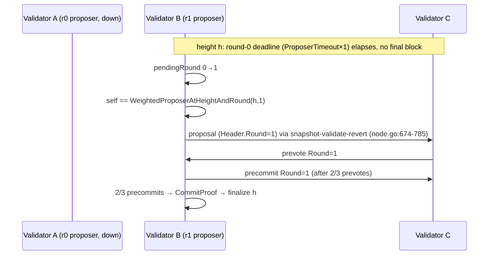
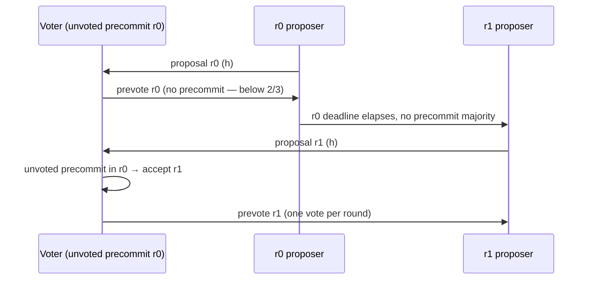
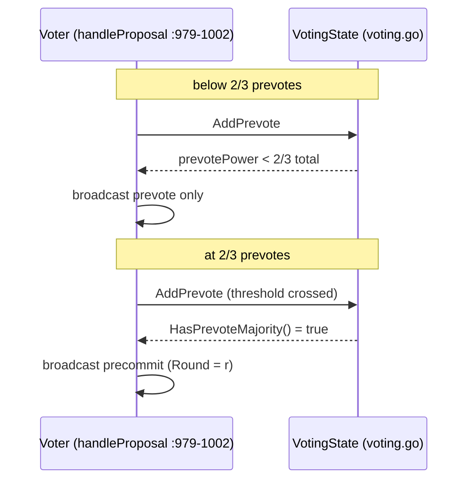

# Design: Consensus Liveness — Multi-Round + View Change

## Technical Approach

Extend the existing 2-phase (preVote→preCommit) BFT-lite scheme with per-round view change. `Round uint32` moves into `BlockHeader` (hashed, wired, bbolt 244→248) as the single round source. The node tracks `pendingRound`, advances on a linear `ProposerTimeout × (1+r)` deadline (capped by `MaxRound`), and the proposer for `(height, round)` is `(height+round) % totalPower` over `GetActiveValidators` ordering — round 0 reproduces today's schedule exactly. Precommits are gated on a 2/3 prevote majority (aligns `node.go:1000-1001` with `ARCHITECTURE.md:406` + `bft_harness.go:323`). Higher-round proposals replace the pending round only while unvoted. Round gauges are wired through the existing `telemetry` package into the prod `/metrics` handler. Delivered in 3 chained PRs; all 9 spec requirements (15 scenarios) covered.

## Architecture Decisions

| # | Decision | Choice | Alternatives considered | Rationale |
|---|----------|--------|-------------------------|-----------|
| ADR 1 | Round placement | `Round uint32` in `BlockHeader` + `HeaderHash` (`types/block.go:77-102`); chain reset | Round in `CommitProof` + new `MsgTypeProposal` envelope (no hash break, new wire type) | Single round source for proposals/final blocks/sync/replay/forks; proposal IS a proof-less block frame (`gossip.go:18-111`), no new wire type; reset approved at v0.1.0 (zero tags) |
| ADR 2 | Proposer schedule | `WeightedProposerAtHeightAndRound(h,r)` = offset `(h+r) % totalPower`; keep `WeightedProposerAtHeight` as round-0 alias (`consensus/proposer.go:11`) | VRF/keccak selection (WHITEPAPER aspirational); height-only (today) | Same ordering input as today (`staking.GetActiveValidators`, power DESC / ConsensusID ASC, `registry.go:294-324`; `block_validator.go:129-132`) → deterministic lockstep; round 0 ≡ today keeps `proposer_test.go:47,102` green unmodified |
| ADR 3 | Timeout backoff | Linear `ProposerTimeout × (1+r)` (5s base, `config.go:101`), advance in loop (`node.go:579-632`); `MaxRound` cap = wait+rebroadcast; config rejects base ≤ 5s | Capped exponential `base << r`; no cap | Deterministic lockstep advancement; round-1 deadline 10s >> ±5s skew (`timestamp.go:8`); `MaxRound` prevents infinite stall; single knob — spec pins `ProposerTimeout`, no new `RoundTimeoutBase` |
| ADR 4 | Precommit gating | Precommit only after `HasPrevoteMajority()`; prevote always | Defer to follow-up change | Code matches its own doc (`ARCHITECTURE.md:406`) + harness (`bft_harness.go:323-330`); shrinks cross-round dual-commit window (spec Requirement: Precommit Gating) |
| ADR 5 | Higher-round replacement | Accept `(h, r+1)` only if unvoted in `(h, r)`; mirrors `replace` + `votingHasExternalVotes` guards (`node.go:725-738`, `:789-805`) | Always adopt latest round; lock to first proposal | One vote per (height, round) (`voting.go:74-76`); replacing a voted round orphans peer votes and deadlocks — same reason stale-refresh guards exist; equivocation stays dropped (`node.go:981-984`) |
| ADR 6 | Round metrics | Wire `telemetry` into prod `/metrics` (`startup.go:767-773`); add `dsn_consensus_round`, `dsn_consensus_height` gauges | Hand-roll like `dsn_block_height` | `telemetry` defines 8 metrics with zero prod wiring (no `telemetry.` usage in `node/`); promauto + promhttp is the gap fix; `OPERATIONS.md:161` already documents `dsn_consensus_round` — makes ops doc true |
| ADR 7 | bbolt layout | `expectedHeaderLen` 244→248 (`persist.go:185`); append/read `Round` after `Proposer` in `encodeHeader`/`decodeHeader` (`:188-250`) | Migrate stored headers | Hash change already invalidates chains (ADR 1); 244-byte headers fail the decode len check (`persist.go:220-222`) → re-sync triggers naturally; no migration at v0.1.0 |
| ADR 8 | Non-goals locked | No BLS, no Tendermint locking/amnesia evidence, no evidence-pool wiring (`node.go:682` TODO), no RPC round exposure, no governance/delegation | Full PBFT-style rewrite (exploration Approach 3) | BFT-lite ethos (`product-strategy.md:40`); most recently stabilized code is the blast radius; cross-round dual-commit caveat documented; k=6 (`node.go:80`) remains finality |

## Sequence Diagrams

**View change — stuck proposer → finalize at r ≥ 1**



**Higher-round replacement when unvoted**



**Precommit gating — below vs at 2/3 prevotes**



**Cross-round fork — chain stays single-valued**

```mermaid
sequenceDiagram
    participant A as Validators (r0)
    participant B as Validators (r1)
    participant N as Chain node
    Note over A,N: partition: A@r0 and B@r1 each reach 2/3 precommits, same height
    A-->>N: final block X (Round=0, CommitProof)
    B-->>N: final block Y (Round=1, CommitProof)
    N->>N: first-arrival + fork-weight tiebreaker (node.go:1187-1189)
    N->>N: single-valued chain; k=6 (finalityK=6) is the finality answer
```

## Data Flow

```
    runConsensusLoop (:579-632)
        │  height = tip+1; round = pendingRound
        ▼
    consensusProposerAtHeightAndRound(h, r) ──(h+r)%totalPower──> GetActiveValidators (registry.go:294)
        │ proposer == self?
        ▼
    proposeForHeight(h, r) ──BuildBlock──> ValidateBlockProposal ──NewVotingState(h, r, …)
        │ broadcast proposal (Header.Round=r) + prevote
        ▼
    peer votes ──handleVoteMessage──> VotingState.AddPrevote/AddPrecommit
        │ precommit gated on HasPrevoteMajority()
        ▼
    tryFinalizeLocked ──BuildCommitProof──> final block ──applyAcceptedBlock/finalizeLocalBlock
        │
        └─ deadline ProposerTimeout×(1+r) elapsed & not finalized ──> pendingRound++ (≤ MaxRound)
```

## File Changes — 3-PR Slices

**PR1 — types/wire/validation plumbing** (keep `make test` green)

| File | Action | Description |
|------|--------|-------------|
| `types/block.go` | Modify | Add `Round uint32` to `BlockHeader` (~`:19`, after `Epoch`); write in `HeaderHash` (`:92-94`) |
| `consensus/persist.go` | Modify | `expectedHeaderLen` 244→248 (`:185`); `encodeHeader` append Round after Proposer (`:212-215`); `decodeHeader` read it (`:247-248`) |
| `consensus/gossip.go` | Modify | `EncodeBlockMessage` write Round after Epoch (`:42`); `DecodeBlockMessage` read (`:161-163`) |
| `consensus/proposer.go` | Modify | Add `WeightedProposerAtHeightAndRound(h, r)`; `WeightedProposerAtHeight(h)` = round-0 alias |
| `consensus/block_validator.go` | Modify | Proposer check uses `(Height, Header.Round)` (`:153`); `validateCommitProof` requires precommit `Round == proof/header round` (`:309-314`) |
| `consensus/persist_test.go`, `node/proposer_test.go` | Modify | Header-length tests 244→248; re-sync rejection (244-byte decode fails); round-0 schedule equivalence |

**PR2 — node round state machine + loop + gating**

| File | Action | Description |
|------|--------|-------------|
| `node/node.go` | Modify | `newVote` round param (`:949-961`); `NewVotingState(h, round, …)` (`:760`); `pendingRound` field + reset (`:940-945`); `handleProposal` one-vote-per-(h,r) + higher-round-when-unvoted (`:979-1002`); loop round-aware proposer + deadline advancement capped by `MaxRound` (`:579-632`, `:600`); rebroadcast/stale-refresh round-aware (`:839-870`); prevote-gated precommit (`:1000-1001`, `:886-895`) |
| `node/config.go` | Modify | `MaxRound uint32` knob + default 8 (`:12-89`, `:91-119`) + `DSN_MAX_ROUND` env (`:123+`); reject `ProposerTimeout ≤ 5s` |
| `node/consensus_loop_test.go` | Modify | Keep 4 regression tests green (`:23,92,216,346`); add view-change suite (RED first) |
| `consensus/bft_harness.go`, `consensus/voting_test.go`, `node/node_test.go` | Modify | Harness round>0 simulation; existing `Round: 0` sites stay valid |

**PR3 — metrics + docs/config alignment**

| File | Action | Description |
|------|--------|-------------|
| `telemetry/metrics.go` | Modify | Add `dsn_consensus_round` / `dsn_consensus_height` gauges |
| `node/startup.go` | Modify | Wire telemetry into `handleMetrics` (`:767-773`); record gauges on round change / finalize |
| `docs/ARCHITECTURE.md` | Modify | Make `:398-406` aspirational text describe implemented semantics |
| `docs/dsn_protocol_spec_v_1.md` | Modify | Add round/view-change content (net-new) |
| `openspec/config.yaml` | Modify | `:7` → 2-phase + per-round view change; `:10` → 16 RPC methods |

## Interfaces / Contracts

```go
// types/block.go — new header field (hashed at types/block.go:92-94)
Round uint32 // consensus round this block was proposed in; genesis Round 0

// consensus/proposer.go — round-aware schedule, round 0 ≡ WeightedProposerAtHeight
func WeightedProposerAtHeightAndRound(height uint64, round uint32, validators []*staking.Validator) types.Address

// node/config.go — knobs
MaxRound uint32 // default 8; DSN_MAX_ROUND env; advance stops at cap (wait + rebroadcast)

// telemetry/metrics.go — gauges (names match docs/OPERATIONS.md:161)
dsn_consensus_round, dsn_consensus_height
```

bbolt header layout: `Version(8)+Height(8)+Prev(32)+StateRoot(32)+TxRoot(32)+ReceiptRoot(32)+ValRoot(32)+ValSetHash(32)+Epoch(8)+Round(4)+Timestamp(8)+Proposer(20) = 248` bytes.

## Testing Strategy

Strict TDD — view-change tests written RED before implementation (slice 2); regression gate = 4 loop tests green.

| Spec scenario | Test (RED first) | Location |
|---------------|------------------|----------|
| Existing chain re-syncs | `decodeHeader` rejects 244-byte payload; `LoadTip` errors → block-sync path | `consensus/persist_test.go`, `node/node_test.go` |
| Round-0 schedule unchanged | `WeightedProposerAtHeightAndRound(h,0)` == `WeightedProposerAtHeight(h)` over harness set | `consensus/proposer_test.go` |
| Wrong proposer rejected | `ValidateBlockProposal` at `(h,r)` with unscheduled proposer → `ErrWrongProposer` | `consensus/block_validator_test.go` |
| Precommit round mismatch rejected | round-r block with round r−1 precommits → `ErrInvalidCommitProof` | `consensus/block_validator_test.go` |
| Stuck proposer → view change | r0 proposer down; deadline elapses; round ≥1 finalizes | `node/consensus_loop_test.go` (first RED) |
| Higher round accepted when unvoted / one vote per round | unvoted → votes once at r+1; second r vote dropped | `node/consensus_loop_test.go` |
| MaxRound caps advancement | at cap, deadline elapses → no advance, rebroadcast/wait | `node/consensus_loop_test.go` |
| Clock-skew tolerance | config validation rejects `ProposerTimeout ≤ 5s` | `node/config_test.go` |
| Precommit withheld below / sent at majority | <2/3 prevotes → prevote only; ≥2/3 → precommit at r | `node/consensus_loop_test.go` |
| Equivocation → round advance | conflicting proposals r0; deadline → r+1, one vote | `node/consensus_loop_test.go` |
| Cross-round fork single-valued | two 2/3-precommit blocks, rounds 0/1, same height → one applied | `node/node_test.go` + harness |
| Gauges exposed | scrape `/metrics` → both gauges present with current (h, r) | `node/startup_test.go` |
| Config and docs accurate | config.yaml 2-phase/16-methods; protocol spec round content | verify phase (doc review) |

Harness: `bft_harness.go:323-330` already gates precommits on prevote majority — extend `simulateVoting` to run a round>0 scenario.

## Threat Matrix

N/A — no routing, shell command, subprocess, VCS/PR automation, executable-file classification, or process-integration boundary. (Wire-format change is an in-process `EncodeBlockMessage`/`DecodeBlockMessage` protocol boundary handled by decode strictness, not process integration.)

## Migration / Rollout

Chain reset (approved). Procedure: stop all nodes → snapshot genesis/config for deterministic re-sync → remove data dirs → restart with new binary → nodes re-sync from genesis/snapshot. No in-place DB migration (ADR 7). Rollback = revert PR chain AND re-sync again — 248-byte headers are unreadable by reverted code (`persist.go:220-222`); acceptable at v0.1.0. Feature-flag-free; knobs (`MaxRound`, timeout base) are config-only.

## Open Questions

- [ ] `MaxRound` default value (proposed 8) and `DSN_MAX_ROUND` env name — confirm in tasks/apply
- [ ] `dsn_block_height` hand-rolled output: migrate to telemetry or leave as-is alongside new gauges (slice 3 detail)
